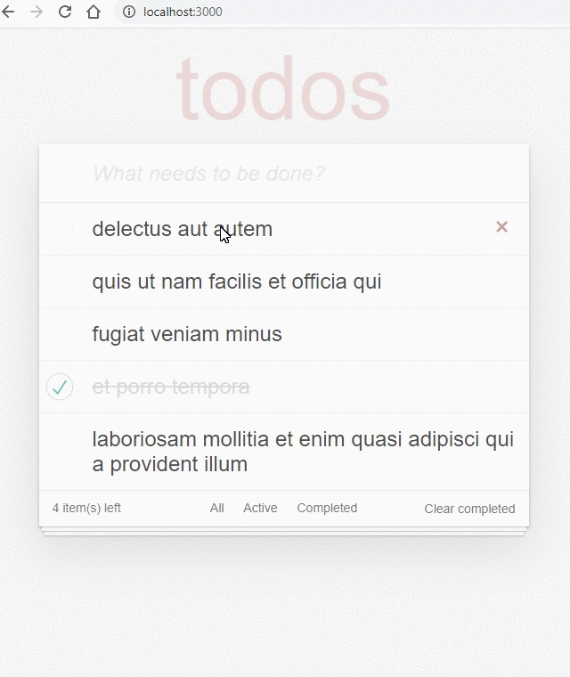

# Assessment: Todo App

For this assessment, you'll be extending a todo application such that users can actually interact with it.

In doing so, you'll be demonstrating a basic understanding of the following:

- modifying component-specific values using state
- responding to user interactions by using event handlers and component methods

The complexity of event handlers can increase when working with lists of components where each component needs its own "parameterized" version of the event handler.

Consider how the `handleDelete` method below works.

```js
function MyComponent(props) {
  const [accounts, setAccounts] = useState([
    { id: 2938 },
    { id: 3874 },
    { id: 6984 },
  ]);

  const handleDelete = (event, accountId) => {
    const newAccounts = accounts.filter((account) => account.id !== accountId);
    setAccounts(newAccounts);
  };

  return (
    <React.Fragment>
      <h1>Active Accounts</h1>
      {accounts.map((account) => (
        <div>
          <p>Account: {account.id}</p>
          <button onClick={(event) => handleDelete(event, account.id)}>
            Delete Account
          </button>
        </div>
      ))}
    </React.Fragment>
  );
}
```

Notice how we are passing both the `event` and the `accountId` to the `handleDelete` function. Then, inside the callback function that we pass to the button's onClick property, we call the `handleDelete` function and pass it 2 arguments: the `event` and the `account.id`.

## Geting Started

Setup:

1. create a `dev` branch
2. run `npm install` to install the required dependencies
3. run `npm start` to start the development server.
4. visit `localhost:3000` in your browser to see the current version of your app.

Adding a Todo:

1. add a state variable to track the user's input.
2. set the onChange for the input element to a function which updates the user's input in state.
3. add an event listener to the window object that listens for a keydown. Pass a callback function to this event listener which creates and adds a todo to the `todos` state variable. The added todo should have a `title` property equal to whatever the user wrote in the input element. Don't forget add an `id` and `completed` property to this new todo.

Marking a Todo as Completed:

1. Inside `App.js` create a `toggleComplete` function which takes in both an `event` and a `todoId`.
2. Pass the `toggleComplete` function as a prop to the `TodoList` component. Then pass `props.toggleComplete` as a prop to the `TodoItem` component.
3. set the onChange for the checkbox input inside of `TodoItem.js` to the `props.toggleComplete` function which was passed down from `App.js`. Make sure you pass both the `event` and the correct `todoId` to `props.toggleComplete`

Deleting a Todo:

1. Inside `App.js` create a `deleteTodo` function which takes in both an `event` and a `todoId`.
2. Pass the `deleteTodo` function as a prop to the `TodoList` component. Then pass `props.deleteTodo` as a prop to the `TodoItem` component.
3. set the onClick for the "destroy" button inside of `TodoItem.js` to the `props.deleteTodo` function which was passed down from `App.js`. Make sure you pass both the `event` and the correct `todoId` to `props.toggleComplete`

Clear Complete:

create a clearComplete function which removes all completed todos from the todos array in state.
pass the clearComplete function as a prop to the Footer component.
set the props.clearComplete function as the onClick attribute for the clear completed button in the footer.

## Add Routing and Filtering

1. Inside `index.js`, import the `BrowserRouter` component from `'react-router-dom'`, then wrap the `App` component in a `BrowserRouter` component. For example:

```
<BrowserRouter>
 <App/>
</BrowserRouter>
```

2. Update the anchor tags in `Footer.js` to be `Link` components from `react-router-dom`.
3. Update `App.js` so that it contains the routes necessary to create filtered views of the todo list as shown below.
4. On the routes for the filtered views, when passing the todos into the `TodoList` component add a filter which filters the todos based on their `completed` property.

## Example Output



# Requirements

- Typing into the top input and hitting the Enter/return key adds a todo and empties the input.
- Clicking on the circle at the beginning of a todo toggles whether that todo is completed or not.
- Clicking the "X" on the right side of a Todo removes it from the list.
- Clicking the button 'Clear Completed' will delete all todos that are marked as complete.
- User can click on the All, Active, and Completed links in the footer to see filtered views of the todos.
- The "Items left" counter in the footer properly shows the number of incomplete todos.

# Credits and References

Author: Zachary Balaska

References: Kenzie Demos and content,

With assistance from fellow student Eric Hoover, coach Manny Ledoux, Associate instructor TJ Hindman, and Facillitator Meagan Ramey

[Medium] - (https://medium.com/the-andela-way/handling-user-input-in-react-crud-1396e51a70bf)

[useHooks] - (https://usehooks.com/useKeyPress/)

[stackOverflow] - (https://stackoverflow.com/questions/5418313/how-to-differentiate-between-enter-and-return-keys-in-javascript)

[npmjs]- (https://www.npmjs.com/package/uuidv4)

[youtube] - (https://www.youtube.com/watch?v=hQAHSlTtcmY)
